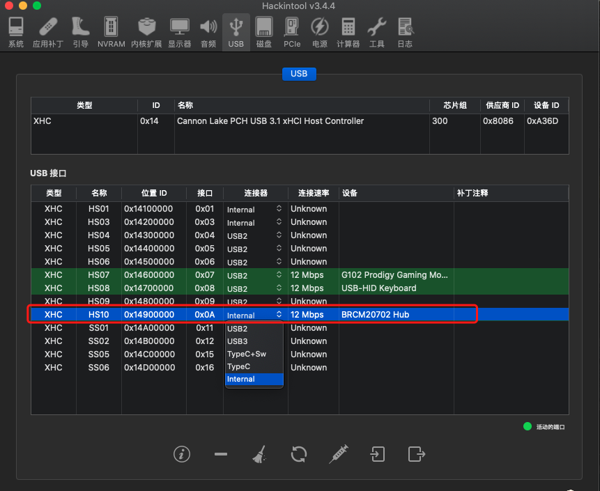
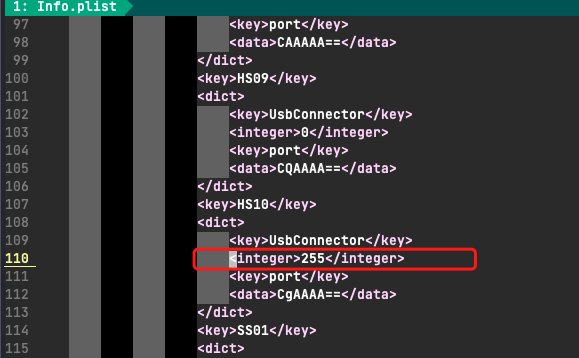

Hackintosh黑苹果长期维护机型整理清单：<https://blog.daliansky.net/Hackintosh-long-term-maintenance-model-checklist.html>

其中本人台式机主板是`Gigabyte B360M AORUS PRO`，大家有需要可以直接从该网址查看适合自己台式机的EFI。

> 问题与处理：
  - 购买了mac免驱wifi蓝牙模块后，发现电脑睡眠又会被自动唤醒，Google得到的结果是因为蓝牙设备(`BRCM20702 Hub`)使用的USB连接器不是内建的，可以通过`Hackintool`工具来查看。
  - 通过`Clover Configuration`工具挂载EFI分区，用vim打开`/Volumes/EFI/EFI/OC/Kexts/USBPorts.kext/Contents/Info.Plist`文件，将指定名称的USB接口配置(本人的是`HS10`)的`integer`改为255，保存并重启电脑即可解决，具体操作可观看[黑苹果解决睡眠唤醒之蓝牙内建](https://www.bilibili.com/s/video/BV1CQ4y1M7oZ)加深理解。
  - 
  - 
