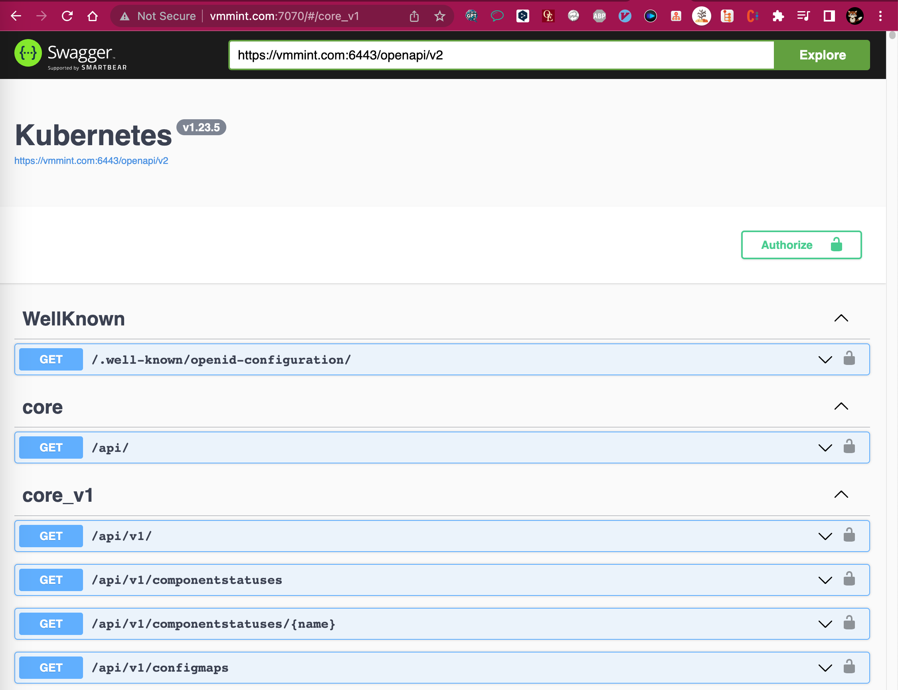

# 通过-swagger-ui-查看-kube-apiserver-apis

参考文档: <https://qhh0205.github.io/2020/07/11/%E9%80%9A%E8%BF%87-swagger-ui-%E6%9F%A5%E7%9C%8B-kube-apiserver-apis/>

### 安装swagger-ui并访问kubernetes api
1. vmmint.com所在服务器上启动 swagger-ui 服务

```shell
docker run --name swagger-ui --restart always -p 7070:8080 -d swaggerapi/swagger-ui:latest
```

2.访问 swagger-ui 地址 http://vmmint.com:7070，输入 kube-apiserver 地址的 openapi 接口地址：https://vmmint.com:6443/openapi/v2

> 注意：先要确保本地能正常访问https://vmmint.com:6443/openapi/v2接口数据

> 注意：直接访问存在跨域问题，需要安装 Chrome 的 Allow CORS 插件实现跨域访问
> 
> 插件传送门：<https://chrome.google.com/webstore/detail/allow-cors-access-control/lhobafahddgcelffkeicbaginigeejlf?hl=en>
> 
> 观看该插件的使用视频，熟悉使用方法。
> 

3.操作成功后的样例：

