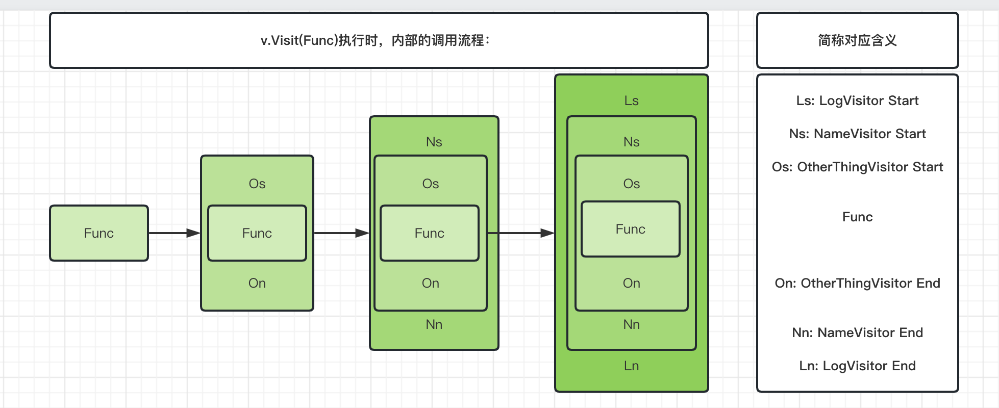

# 访问者模式
- 参考文档: <https://jeffdingzone.com/2021/02/k8s%E6%BA%90%E7%A0%81%E5%88%86%E6%9E%903-kubectl%E5%AE%9E%E7%8E%B0%E5%88%86%E6%9E%90/>

### 代码实现:
```go
package main

import "fmt"

// go访问者模式！
// 细细想来，下面的demo实现的效果其实和gin中的指责链模式是一样的，是吗？

type VisitorFunc func(*Info, error) error

// Visitor 访问器基类，用于修改资源类型的操作
type Visitor interface {
	Visit(VisitorFunc) error
}

// Info 封装了一些client调用时所需要的基本信息
type Info struct {
	// 指定namespace的时候才会设置这个参数
	Namespace string
	Name      string

	// 可选参数 url或者文件路径
	Source string

	OtherThings     string
	ResourceVersion string
}

// Visit implements Visitor
func (i *Info) Visit(fn VisitorFunc) error {
	return fn(i, nil)
}

// NameVisitor 假设这个visitor主要用于访问 Info 结构中的 Name 和 NameSpace 成员
type NameVisitor struct {
	visitor Visitor
}

func (v NameVisitor) Visit(fn VisitorFunc) error {
	return v.visitor.Visit(func(info *Info, err error) error {
		fmt.Println("NameVisitor() before call function")
		err = fn(info, err)
		if err == nil {
			fmt.Printf("==&gt; Name=%s, NameSpace=%s\n", info.Name, info.Namespace)
		}
		fmt.Println("NameVisitor() after call function")
		return err
	})
}

// OtherThingsVisitor
// 这个Visitor主要用来访问 Info 结构中的 OtherThings 成员
type OtherThingsVisitor struct {
	visitor Visitor
}

func (v OtherThingsVisitor) Visit(fn VisitorFunc) error {
	return v.visitor.Visit(func(info *Info, err error) error {
		fmt.Println("OtherThingsVisitor() before call function")
		err = fn(info, err)
		if err == nil {
			fmt.Printf("==&gt; OtherThings=%s\n", info.OtherThings)
		}
		fmt.Println("OtherThingsVisitor() after call function")
		return err
	})
}

// LogVisitor .
type LogVisitor struct {
	visitor Visitor
}

func (v LogVisitor) Visit(fn VisitorFunc) error {
	return v.visitor.Visit(func(info *Info, err error) error {
		fmt.Println("LogVisitor() before call function")
		err = fn(info, err)
		fmt.Println("LogVisitor() after call function")
		return err
	})
}

// 调用逻辑
func main() {
	info := Info{}
	var v Visitor = &info

	loadFile := func(info *Info, err error) error {
		info.Name = "Hao Chen"
		info.Namespace = "MegaEase"
		info.OtherThings = "We are running as remote team."
		fmt.Println("1")
		return nil
	}

	v = LogVisitor{v}
	v = NameVisitor{v}
	v = OtherThingsVisitor{v}
	// 这里在层层解析(OtherThingsVisitor -> NameVisitor -> LogVisitor)的时候，
	// 函数也在层层封装(OtherThingsFunc -> NameFunc -> LogFunc)
	v.Visit(loadFile)

	//v = NewDecoratedVisitor(v, NameVisitor, OtherThingsVisitor)
	//v.Visit(loadFile)
}

```

函数一层一层传递的示意图如下：

