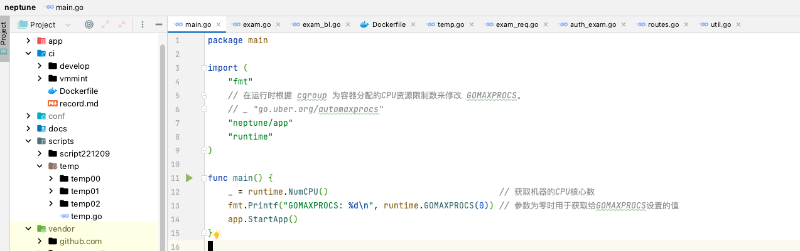
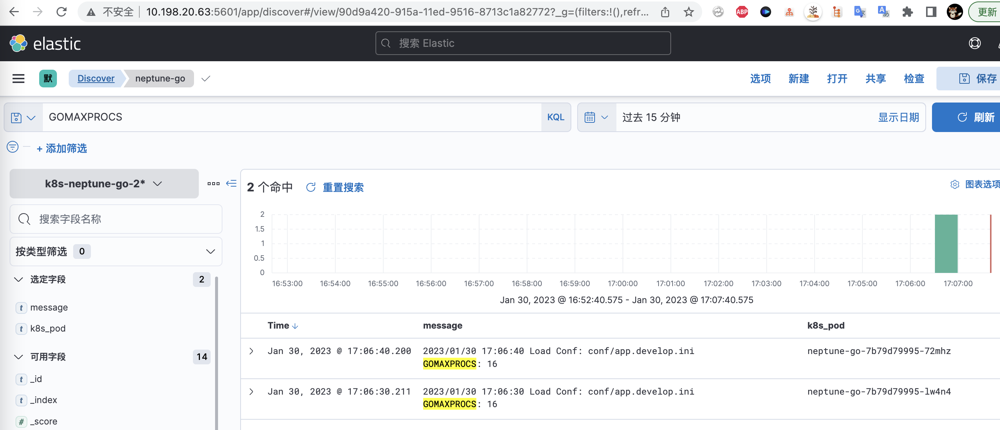
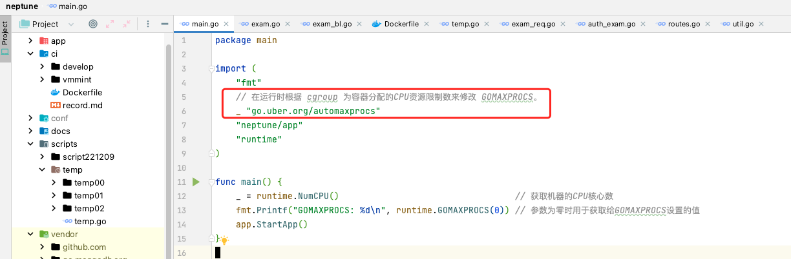
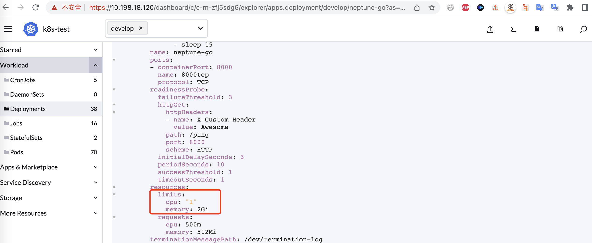
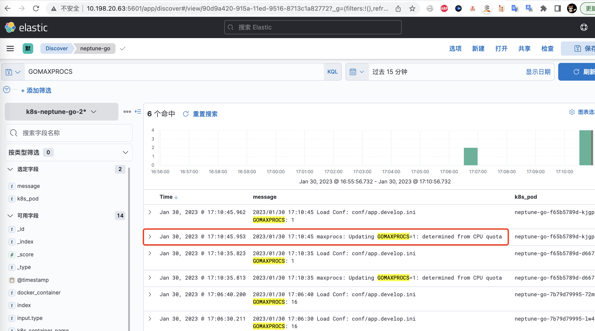

# 容器运行go服务时GOMAXPROCS设置问题

question: 如何限制go服务可以使用的cpu核心数，从而和容器被允许使用的核心数保持一致？

## GOMAXPROCS介绍

`GOMAXPROCS`用来设置最大的可同时使用的 CPU 核数，如果容器被限制为只能使用较少的cpu核数，
但容器内部的go程序并没有被限制，设置 GOMAXPROCS 高于真正可使用的核心数后会导致Go调度器不停地进行OS线程切换，从而给调度器增加很多不必要的工作。

目前 Go 官方并无好的方式来规避在容器里获取不到真正可使用的核心数这一问题，而 Uber 提出了一种 Workaround 方法，利用  `go.uber.org/automaxprocs` 这一个包，可以在运行时根据 cgroup 为容器分配的CPU资源限制数来修改 GOMAXPROCS。

## 操作记录

不引入`go.uber.org/automaxprocs`时，该值为16

引入后，该值变为了1