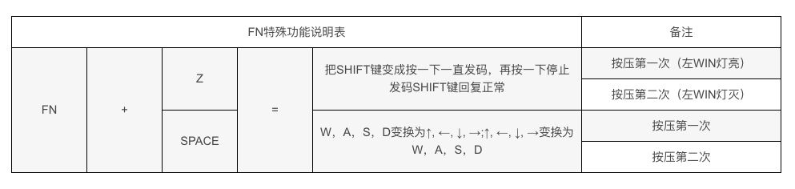

# poker改键记录

- 把`ESC`编为`~`：`Fn+右Ctrl，Esc，～，Pn，Fn+右Ctrl`，现在，按`Pn+Esc`，就是`～`了。

### poker 特殊功能说明

### hammerspoon 按键说明

- `alt + r` 窗口放置功能 q或esc推出
- `alt + tab` 应用切换
- `alt + a` 快速启动应用，可在`~/.hammerspoon/private/config.lua`配置
